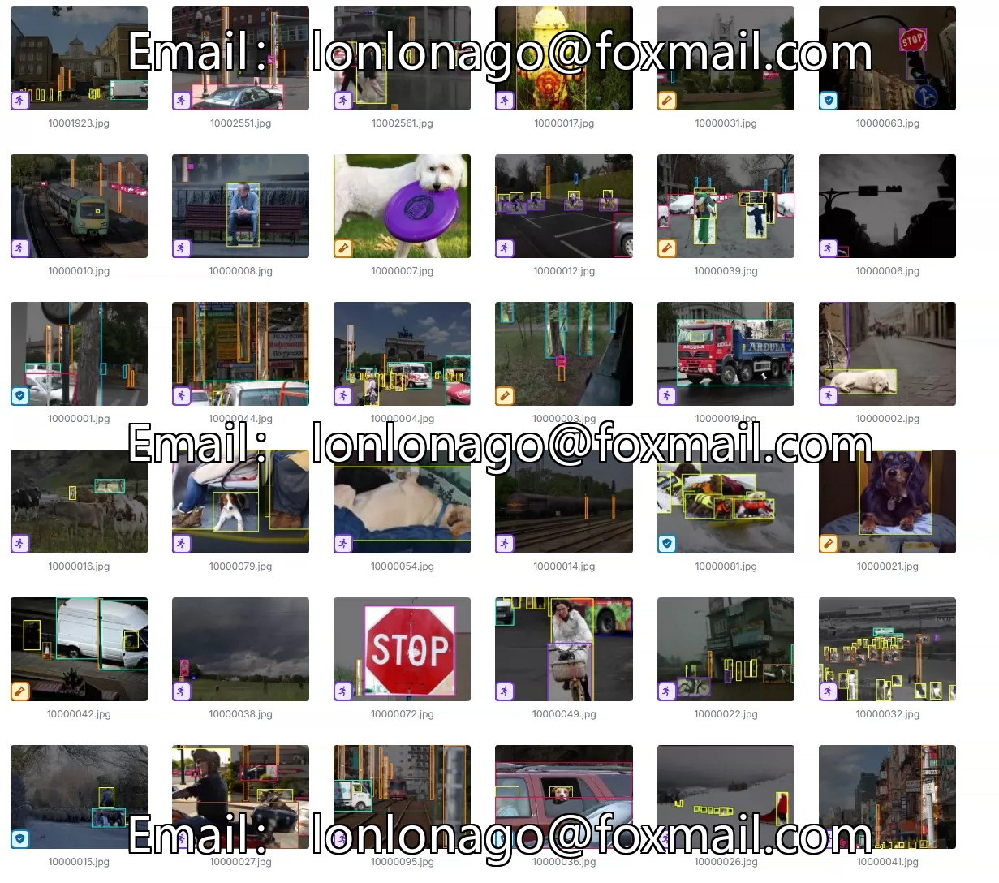
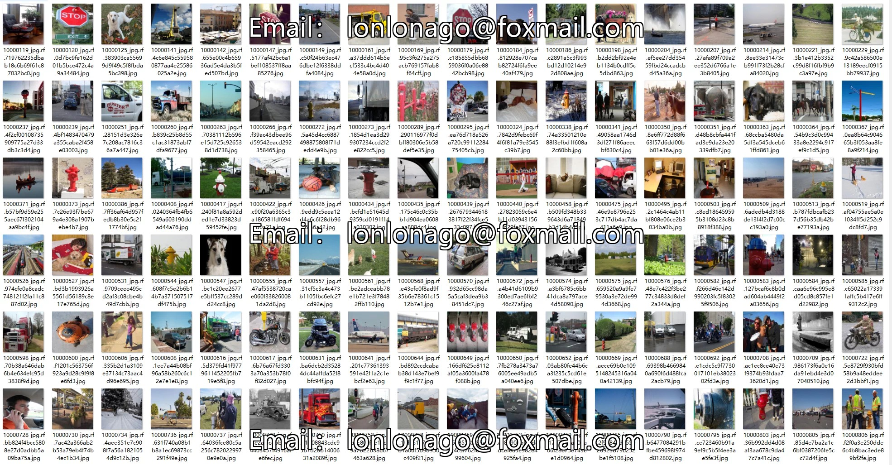
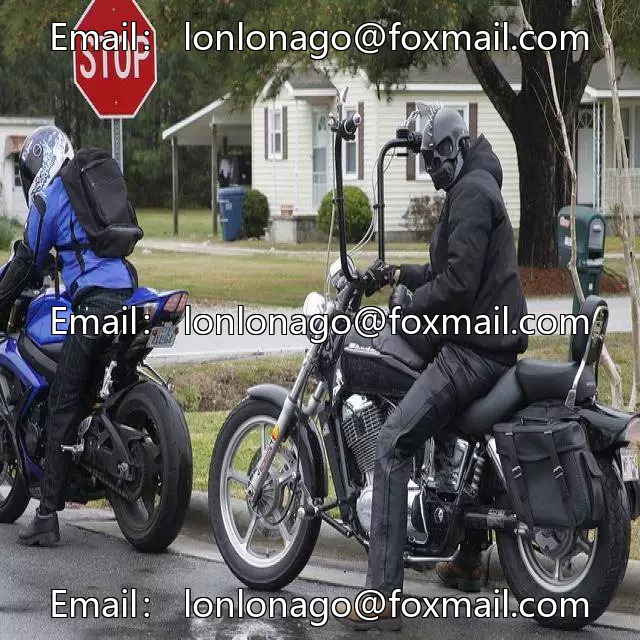
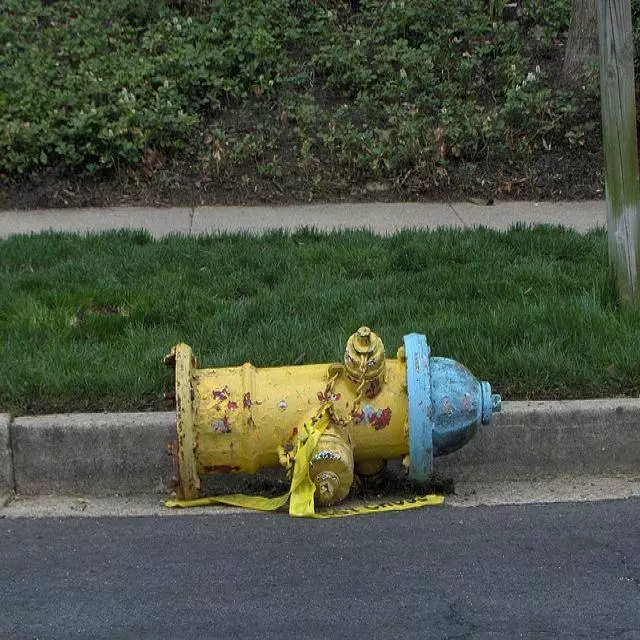
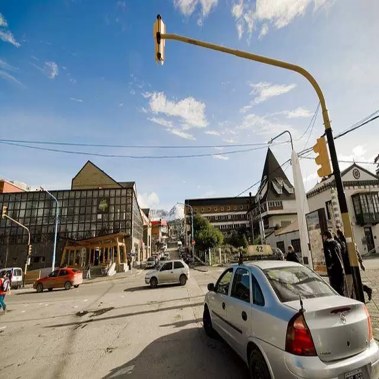
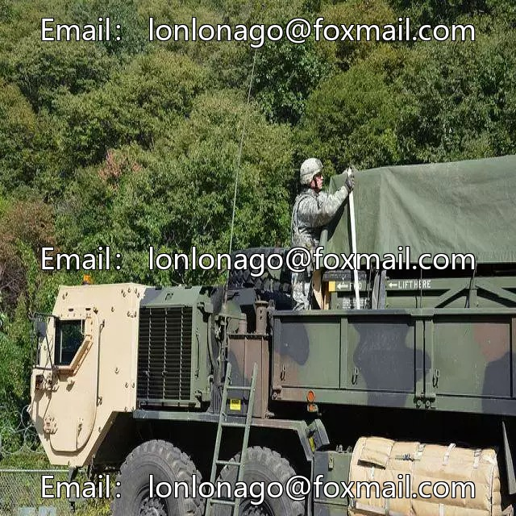

## Body

Artificial Intelligence Assisted Mobile Tools for the Blind
Target Detection Dataset

Totally 10k+ images, each labeled separately.
Divided into 19 categories: 'ashcan', 'bicycle', 'blind_road', 'bus', 'car', 'crosswalk', 'dog', 'fire_hydrant', 'green_light', 'motorcycle', 'person', 'red_light', 'reflective_cone', 'roadblock', 'sign', 'tree', 'tricycle', 'truck', 'warning_column'

'Trash Can', 'Bicycle', 'Blind Road', 'Public Bus', 'Car', 'Pedestrian Crossing', 'Dog', 'Fire Hydrant', 'Green Light', 'Motorcycle', 'Person', 'Red Light', 'Reflective Cone', 'Road Block', 'Sign', 'Tree', 'Tricycle', 'Truck', 'Warning Column'

Electronic virtual products sold are not returnable.

## Images

Here is a pay link on Stripe ( https://buy.stripe.com/3cs8yP7sY87d0vu9AB ). Please contact me lonlonago@foxmail.com after funding $89, and I will send you a complete data files , thank you!

